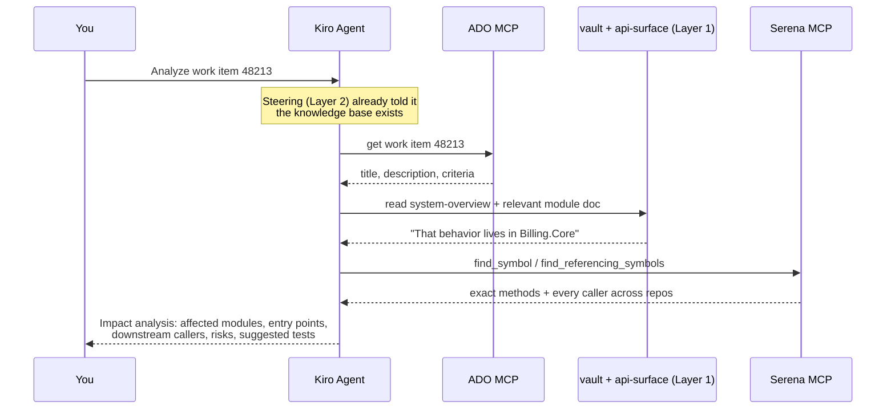

# How This Mechanism Works (plain language)

Read this once, slowly. Everything else in the kit is just an implementation of this page.

## The problem we're solving

AI coding agents (Kiro, Copilot, Claude) have **no memory of your codebase**. Every new chat starts blind. On a large multi-repo C#/.NET system that means:

- The agent re-reads code from scratch every time → slow, expensive, hits context limits.
- It only sees fragments, so it **guesses** how things connect → confident but wrong answers.
- It can't see across your dependent repos at all unless you hand-feed files.

## The solution: five layers

Think of onboarding a new senior developer. You wouldn't make them read a million lines of code before answering their first ticket. You'd give them:

### Layer 1 — The Library (the knowledge vault's `architecture/` + workspace `docs/api-surface/`)
**Pre-written knowledge, generated once, updated occasionally.**

Two kinds of documents, in two homes:

- **Architecture docs** (the knowledge vault's `architecture/` folder — `~/Documents/Engineering Knowledge Base/architecture/`) — human-readable explanations, one per module: what it's for, its key types and entry points, who calls it, what external systems it touches, its gotchas. Plus one `system-overview.md` tying everything together, and one `contract` doc per repo describing what that repo exposes to the outside world. *These are written by the agent itself* (using the prompts in `prompts/`), then reviewed by you.
- **API surface dumps** (`docs/api-surface/`, inside the workspace) — machine-generated by the **ApiSurfaceDumper** tool using Roslyn (the actual C# compiler). Every public type and member, with signatures, XML-doc summaries, and a project dependency graph. This is *compiler truth*: when you ask "how is this method exposed?", the answer comes from here, not from the agent's imagination. It stays in the workspace because it's regenerated, commit-tied output — it would only pollute the vault.

Why plain markdown? Because it's **portable** (Kiro, Copilot, and Claude all read it — each tool just gets a thin adapter, see `05` and `06`) and **reviewable** (a wrong doc gets fixed like wrong code). The curated docs live in one **external Obsidian-compatible vault** shared with the investigation-notes suite — one knowledge home across tools and machines, browsable as a single vault. The trade-off — vault content no longer travels with branches/PRs — is covered by the freshness stamps and the checker (see "How it stays honest").

### Layer 2 — The Librarian's Index (Kiro steering files, `.kiro/steering/`)
**Small always-loaded pointers that tell the agent the library exists.**

Steering files are Kiro's persistent-context feature: they're injected into every conversation in the workspace, and the CLI picks them up too. We keep them deliberately **thin** — the index file basically says:

> "This workspace has a knowledge base. For any question about behavior, read the vault's `architecture/system-overview.md` first, then the relevant module doc. Treat `docs/api-surface/` as ground truth for what's public. Use Serena's symbol tools instead of grepping."

Domain-specific steering files use `fileMatch` inclusion, so when you're working inside, say, the Billing code, the Billing architecture doc gets pulled in automatically.

**Why not put everything in steering?** Because steering is loaded into *every* conversation. Big steering = wasted context and a distracted agent. Thin index in steering, depth in `docs/` — the agent fetches depth only when needed.

### Layer 3 — The Magnifying Glass (Serena MCP server)
**Live, IDE-grade code navigation for whatever the docs don't cover.**

Docs answer "what is this and why". For "show me exactly who calls `RecalculateBalance` and what happens next", the agent needs to *navigate real code*. Serena is a free, open-source MCP server that runs a real language server (for C#, the Roslyn language server — the same engine behind VS Code's C# support) and exposes it to the agent as tools:

- `get_symbols_overview` — the shape of a file/namespace without reading it all
- `find_symbol` — jump to a class/method by name
- `find_referencing_symbols` — **who calls this?** (the killer feature for impact analysis)

Because you open the **umbrella workspace** (all repos in one folder, one umbrella solution), these lookups work *across* your dependent repos, like one big codebase. And it's token-efficient: the agent pulls symbols, not whole files — which matters on a codebase your size.

### Layer 4 — The Inbox (Azure DevOps MCP server)
**Tickets arrive inside the same conversation.**

Microsoft's official ADO MCP server lets the agent fetch a work item (title, description, acceptance criteria, comments, links) by ID. For ServiceNow, community MCP servers exist, but the zero-setup path is simply pasting the ticket text — the analysis flow is identical.

### Layer 5 — The Notebook (the vault's `knowledge/` folder)
**Resolved investigations, saved and reused — with an expiry check.**

When a question or ticket gets answered, one minute with `prompts/05-save-finding.md` turns the conclusion into a one-page note: the question, the short answer, the evidence paths, and a *freshness stamp* (the repo commit it was verified against, plus the folders it depends on). Steering rule 8 makes the agent search these notes before re-deriving anything from scratch — and rule 9 keeps them humble: if the stamped files changed since, the note gets re-verified against current code before it's trusted. The mechanism gets smarter with use instead of just accumulating stale text.

## Putting it together: what actually happens

You type into Kiro: *"Analyze ADO work item 48213 — what does it touch and what's risky?"*

Every claim in the answer traces back to a doc path or a real symbol — that's the whole point of the mechanism. (And if a prior note in the vault's `knowledge/` folder already covers the topic, the agent starts there — after checking its stamp.)

## How it stays honest over time

Codebases never stop moving; the mechanism assumes that. Three safeguards stack:

1. **Every answer self-checks** — Serena reads the *current* working tree, and the trust order is fixed (live code > api-surface > architecture docs > knowledge notes), so a stale doc costs a slower start, not a wrong answer.
2. **Staleness is measured, not guessed** — every generated doc and note carries a `repo + commit + watch-paths` stamp, and `pwsh tools/Check-DocFreshness.ps1` asks git what changed since, rating each doc FRESH / DRIFTING / STALE (details in `04-MAINTENANCE.md`).
3. **Hooks nudge at the right moments** — saving a `.csproj` triggers an api-surface reminder, new knowledge notes get their stamps auto-completed, and an opt-in session-start hook surfaces STALE docs (see `05-USING-IN-KIRO.md`).

## Why this beats the alternatives

| Approach | Problem |
|---|---|
| "Just paste code into chat" | Doesn't scale past a few files; no cross-repo view. |
| Agent greps the repo each time | Slow, misses semantic links (grep matches text, not meaning), burns context. |
| One giant auto-generated wiki only | Goes stale; can't answer precise "who calls this" questions. |
| **This kit: thin docs + compiler dumps + live symbol navigation** | Docs give the map, Serena gives the microscope, steering connects them, MCP brings the tickets. Each layer covers the others' weaknesses. |

## Vocabulary cheat-sheet

- **MCP (Model Context Protocol)** — a standard plug for giving AI agents extra tools. Kiro, Copilot, and Claude all speak it.
- **Steering file** — a markdown file in `.kiro/steering/` that Kiro injects as persistent instructions/context.
- **Roslyn** — Microsoft's C# compiler platform. Both ApiSurfaceDumper and Serena's C# support are built on it.
- **Umbrella workspace / umbrella solution** — one parent folder containing all related repos, plus one `.sln` referencing every project, purely so analysis tools can see across repo boundaries.
- **Knowledge vault** — the external Obsidian-compatible folder `~/Documents/Engineering Knowledge Base`, shared with the personal agent suite's `investigations/` notes; this kit maintains its `architecture/` and `knowledge/` subfolders.
- **Knowledge base** — in this kit: the vault's `architecture/` + `knowledge/` plus workspace `docs/api-surface/`, i.e., markdown the agent reads before touching code.
- **Knowledge note** — a one-page record in the vault's `knowledge/` folder of a resolved question: answer + evidence paths + freshness stamp.
- **Freshness stamp** — front matter (`repo`, `source-commit`, `watch-paths`) that lets git prove whether a doc or note is still current.
- **Hook** — a Kiro automation (`.kiro/hooks/*.json`) that fires on events like file saves; this kit ships three.
- **Custom agent** — a Kiro persona config in `.kiro/agents/`; the kit's `codebase-analyst` preloads the knowledge index, pre-approves the kit's safe shell commands, and writes only in the knowledge vault and under workspace `docs/`.
